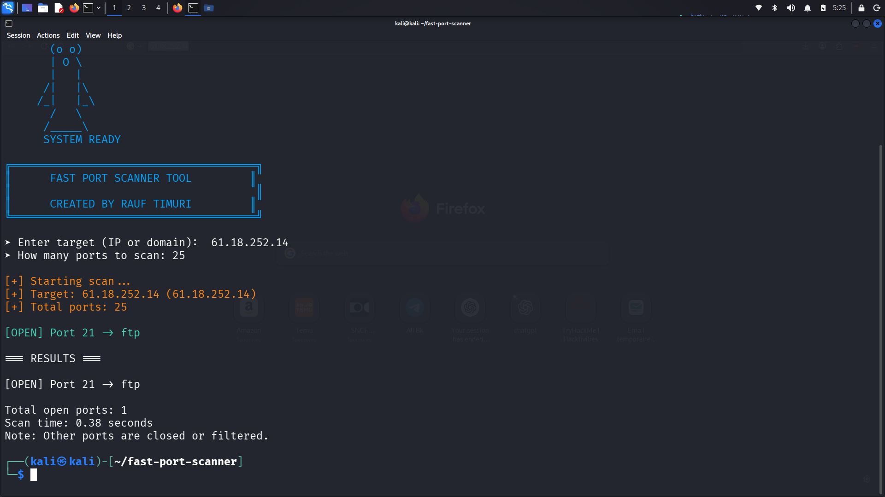

# Fast Port Scanner

Fast TCP port scanner written in Python with live output.

## Features
- Live open port detection
- Multithreaded scanning
- Clean CLI interface
- Service detection

## Usage
python3 menu_portscanner.py

## Example
Enter target (IP or domain): 127.0.0.1  
How many ports to scan: 1000  

## Screenshot

## Disclaimer
This tool is for educational and authorized testing only.
Do not scan systems without permission.
